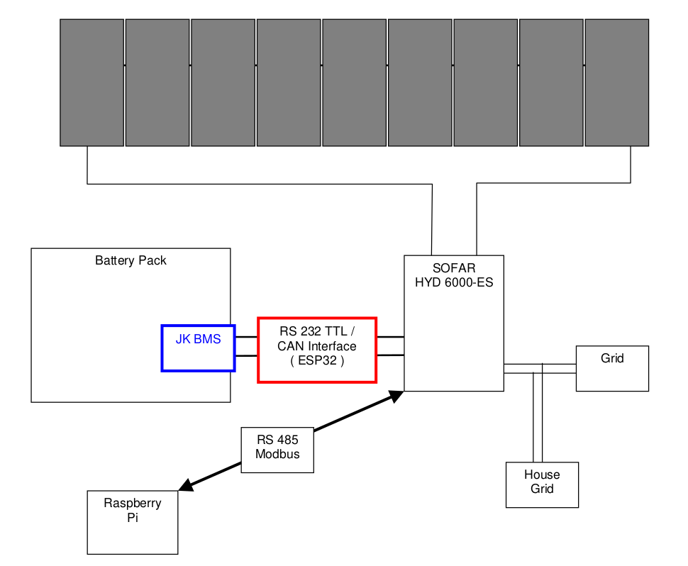
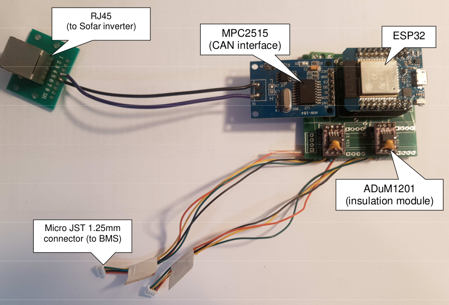

# JK_BMS_to_CAN
RS232 TTL to CAN Pylon Emulation Interface on ESP32
# Introduction
Last year I built a photovoltaic system with batteries. 
I bought a SOFAR HYD 6000-ES inverter, LiFePo4 batteries and BMS (Battery Management System).
But the SOFAR only accepted BMS Pylon CAN connections.  
So I had to develop an interface between my JK BMS and the SOFAR.   
    
The interface is based on a ESP32 whith a MPC2515 CAN interface  
    
Communication between ESP32 and JK BMS is based on RS232 TTL with JK proprietary protocol
    
    
