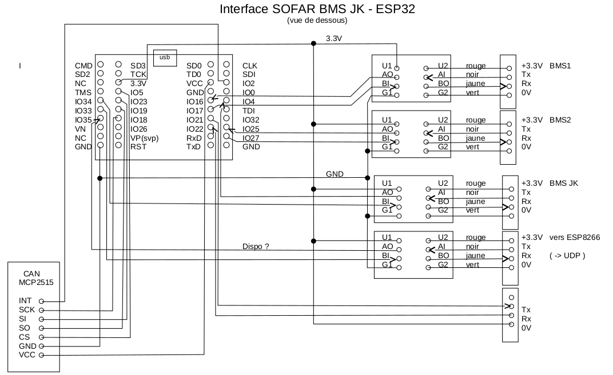

# JK_BMS_to_CAN
JK BMS (RS232 TTL) to CAN Pylon Emulation Interface on ESP32    
# Introduction
Last year I built a photovoltaic system with batteries. 
I bought a SOFAR HYD 6000-ES inverter, LiFePo4 batteries and BMS (Battery Management System).
But the SOFAR only accepted BMS Pylon CAN connections.  
So I had to develop an interface between my JK BMS and the SOFAR.   
    
The interface is based on a ESP32 whith a MPC2515 CAN interface  
    
Communication between ESP32 and JK BMS is based on RS232 TTL with JK proprietary protocol.  
Communication between ESP32 and SOFAR is based on CAN whith Pylon emulation (PylonTech US2000).    
# List of equipment
[ESP32](https://fr.aliexpress.com/item/1005006629784548.html) 
[MPC2515](https://fr.aliexpress.com/item/1005005223498304.html) 
[ADuM1201](https://fr.aliexpress.com/item/32815864904.html) 
[Micro JST 1.25mm Connector](https://fr.aliexpress.com/item/4001171710583.html) 
[JK BMS](https://fr.aliexpress.com/item/1005004590744267.html) 

# ESP32 card schematic diagram
   
This card can communicate with 4 serial lines, but only one (BMS1) is used in this program. 
To connect with the SOFAR I had to isolate the RS232 from CAN. 
It's why I used a ADuM1201 isolation module.

## caution
Do not connect U2 (ADuM1201 3.3V) directly to the BMS, because the JK BMS sends 50V and ADuM1201 needs only 3.3V!   

# JK BMS protocol
[BMS-RS485 Communication protocol.pdf](https://github.com/Bruno-Pau/JK_BMS_to_CAN/blob/main/BMS-RS485Communication%20protocol.pdf)  

# CAN Pylon emulation protocol
[CAN Pylon emulation protocol.pdf](https://github.com/Bruno-Pau/JK_BMS_to_CAN/blob/main/CAN-Bus-protocol-PYLON-low-voltage-V1.2-20180408.pdf)  

# ESP32 code
This code was developed under Arduino 2.0 environnement  
[Sofar5.ino](https://github.com/Bruno-Pau/JK_BMS_to_CAN/blob/main/JkBms_Sofar5.ino)   

# Warning
Messing around with your battery system is not a good idea unless you really, really, know what you are doing. You will also most likely INVALIDATE ANY WARRANTIES.  

While part of this sketch is designed to replicate CAN data to inverter/chargers, IT IS YOUR RESPONSIBILITY to ensure the system behaves correctly and the batteries are properly managed within their operational parameters. Don't come bleating if you:  

> destroy your battery system.  
> destroy your inverter/chargers.  
> burn your house down.  
> do anything worse.
  

## YOU HAVE BEEN WARNED!

# Other links
[jblance - JK BMS RS485 protocol](https://github.com/jblance/mpp-solar/issues/112)  

